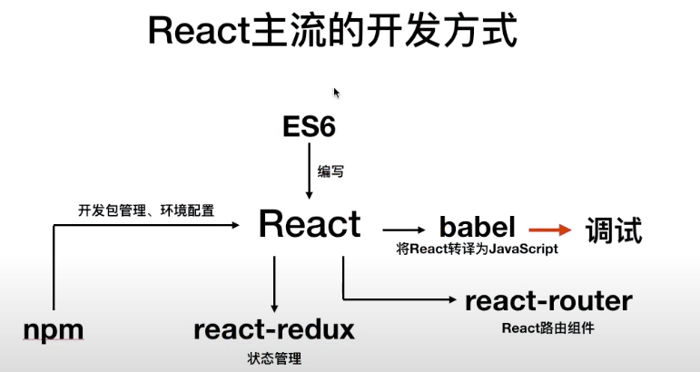

# learningReact

#### 介绍
learning React

#### 使用说明
JomyKingReact 
主流框架 react.js 快速入门 系列视频教程

https://www.youtube.com/watch?v=cRjCPyylKi4&list=PL9nxfq1tlKKmTjPWKIriHWAs5FGRrmmgy

主流框架 react.js 快速入门 系列视频教程

#### demo 项目
使用 create-react-app demo 创建的demo
进入demo目录 run npm start

  npm start
    Starts the development server.

  npm run build
    Bundles the app into static files for production.

  npm test
    Starts the test runner.

  npm run eject
    Removes this tool and copies build dependencies, configuration files
    and scripts into the app directory. If you do this, you can’t go back!

进入VS Code seeting，搜索 emmet  修改includeLanguage 和 triggerExpansionOnTab

#### comment-app 项目

一个提交comment的app

#### demoHtml 项目

通过html来解释React的开发模式、原理
demo1-demo4  html + script 形式
demo1.html   通过传统方式在页面上定义一个按钮
demo2.html   给按钮增加状态 state，修改状态然后重新渲染
demo3.html   显示一个输入框 
demo4.html   显示一个输入框 字符不能超过20 否则显示error信息 并且通过一个按钮可以清楚error信息
demo5.html   使用JSX的语法来渲染 也就是使用javascript代码来生成html代码
demo6.html   接近react的组件包装
es6.html     

 
